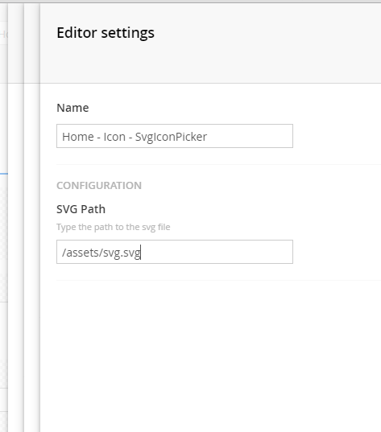
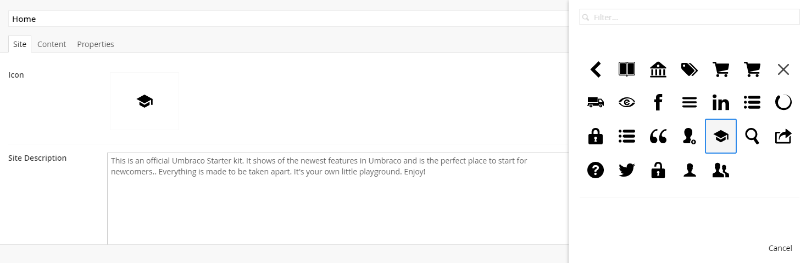

# SVG Icon Picker for Umbraco

[](https://our.umbraco.org/projects/backoffice-extensions/svg-icon-picker/)

An SVG icon picker property-editor for Umbraco 7.


## Getting Started

### Installation

SVG Icon Picker can be installed from either Our Umbraco package repository, or build manually from the source-code:

#### Our Umbraco package repository

To install from Our Umbraco, please download the package from:

> <https://our.umbraco.org/projects/backoffice-extensions/svg-icon-picker/>

#### Manual build

The package can be built using Grunt.

##### Install dependencies

```bash
npm install -g grunt-cli
npm install
```

##### Build

```bash
grunt package
```

The package zip file can be found in the "/pkg/umbraco" folder. This can be installed via the Umbraco back-office.

---

## Usage

Pick "SvgIconPicker" as the editor for your desired icon property.

Type the path to your SVG spritesheet in the configuration.



On the document where you put the editor, it works just like the built in media picker mixed with the icon picker.
You can filter icons, by searching the icons id. Select an icon by clicking it.



The selected icons id is saved as a string in the property value.

---

## Contributing to this project

Anyone and everyone is welcome to contribute. Please take a moment to review the [guidelines for contributing](CONTRIBUTING.md), this applies for any bug reports, feature requests and pull requests.


## Contact

Have a question?

* [Raise an issue](https://github.com/skttl/Umbraco.SvgIconPicker/issues) on GitHub


## Dev Team

* [Søren Kottal](https://github.com/skttl)

### Special thanks #h5yr

* [Warren Buckley](https://github.com/warrenbuckley) for his [Yeoman Umbraco generator](https://github.com/warrenbuckley/generator-umbraco)


## License

Licensed under the [MIT License](LICENSE)
